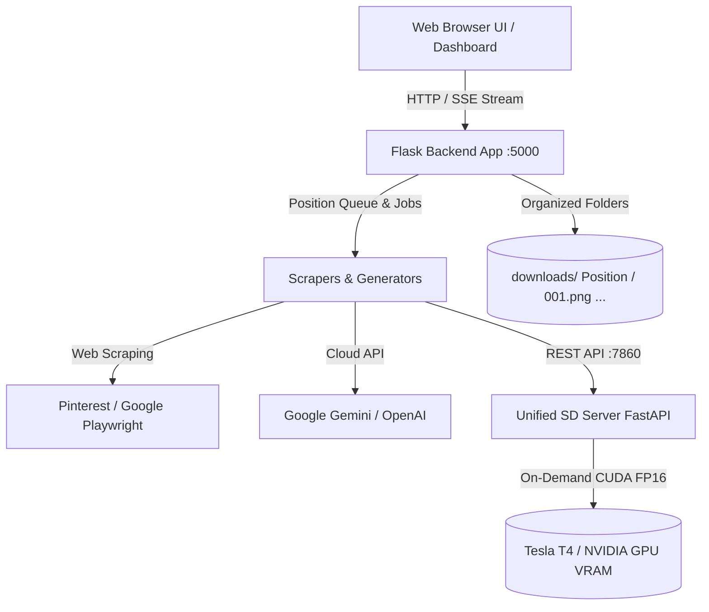

# 📸 TverKar Image Scrapping & Photorealistic AI Generation Platform

A full-stack, automated image scraping and local photorealistic AI generation platform built for assembling curated workplace and persona datasets.

Supports **Local GPU Diffusion Models** (**Juggernaut XL**, **RealVisXL**, **MajicMIX**, **EpiCRealism**, **Realistic Vision**), **Pinterest**, **Google Images**, **Google Gemini Imagen**, and **OpenAI DALL-E 3**.

---

## 🌟 Key Features

- 🎨 **Unified Local Photorealistic AI Engine**:
  - Standalone high-performance microservice (`sd_server.py`) wrapping HuggingFace Diffusers.
  - **Dynamic On-Demand Hot-Swapping:** Switch models directly from the Web UI with zero VRAM conflicts.
  - **Pre-configured SOTA Models:**
    - 🏢 **Juggernaut XL v9 (SDXL 1024×1024):** Workplace environments, uniforms, tools, and industrial machines.
    - 🌟 **RealVisXL v4.0 (SDXL 1024×1024):** High-resolution DSLR human skin texture, pores, and authentic Asian portraits.
    - 🌸 **MajicMIX Realistic v7 (SD 1.5):** Specialized East/Southeast Asian persona and worker portraits.
    - 📷 **EpiCRealism (SD 1.5):** Unposed, natural-light documentary photography.
    - ⚡ **Realistic Vision v6.0 (SD 1.5):** Ultra-fast generation (2–4s per image).
- 📸 **Pro DSLR Documentary Prompt Engine**:
  - Automatically generates natural daylight, unposed action shots, authentic work uniforms, and real skin textures while strictly filtering out plastic/CGI/3D AI artifacts.
- 🤖 **AI-Generated Person Filter (Vision Engine)**:
  - Built-in 2D Fourier Spectrum (FFT) texture analyzer + local Ollama and Gemini/OpenAI vision detection to filter out real human photos and keep only synthetic personas.
- 📦 **1-Click Gallery & ZIP Downloads**:
  - Direct *"View in Gallery"* shortcut right from the scrape progress card.
  - 1-click **Download All (.ZIP)** to download any position's image batch straight to your computer.
  - Smart sorting (*"Recently Generated"*, *Name*, *Count*) and instant search filter.
- 📌 **Multi-Source Scraping**:
  - Pinterest (`pinterest-dl` with browser fallback).
  - Google Images (automated Chromium Playwright).
  - Cloud AI (Gemini Imagen 3 & OpenAI DALL-E 3).

---

## 🏗️ Architecture Overview



---

## 🚀 Quick Start Guide

### System Requirements
* **Python:** 3.10 to 3.12 (Tested on Python 3.12)
* **GPU (For Local AI Generation):** NVIDIA GPU with 6 GB+ VRAM (Tesla T4, RTX 3060/4060 or higher). CUDA 12.x+.
* **Disk Space:** 20 GB+ for model weights and downloaded image datasets.

---

### 1. Installation

```bash
# 1. Clone the repository
git clone https://github.com/Phyrakset/image-scrapping.git
cd image-scrapping

# 2. Create and activate a Python 3.12 virtual environment
python3 -m venv venv
source venv/bin/activate       # Linux/macOS
# .\venv\Scripts\Activate      # Windows PowerShell

# 3. Install dependencies
pip install -r requirements.txt

# 4. Install Playwright Chromium browser
playwright install chromium
```

---

### 2. Running Locally (2 Terminals)

#### 🖥️ Terminal 1: Start Local AI Model Engine
```bash
source venv/bin/activate
python sd_server.py --port 7860
```
> *Loads the default photorealistic model into GPU VRAM and exposes Automatic1111-compatible API endpoints on port `7860`.*

#### 🌐 Terminal 2: Start Web Dashboard
```bash
source venv/bin/activate
python app.py
```
> *Starts the Flask web dashboard on `http://0.0.0.0:5000`.*

#### ☁️ Remote Cloud Access (Optional):
If running on a remote GCP/AWS VM, create an instant secure tunnel:
```bash
npx cloudflared tunnel --url http://localhost:5000
```
Open the generated `https://...trycloudflare.com` URL in your browser.

---

## 📖 User Guide

### 1. Generating Images via Local AI
1. Navigate to **Scrape Images** on the sidebar.
2. Select the **🖥️ Local SD (Free)** tab.
3. In the **Local AI Diffusion Model** dropdown, pick your desired model:
   * **`🏢 Juggernaut XL v9`**: Best for factory uniforms, industrial equipment, safety gear, and warehouse tools.
   * **`🌟 RealVisXL v4.0`**: Best for ultra-photorealistic skin pores, authentic eyes, and natural portraits.
   * **`🌸 MajicMIX Realistic v7`**: Best for specialized Asian workforce portraits.
   * **`⚡ Realistic Vision v6.0`**: Best for high-speed generation (3 seconds).
4. Set **Target Images per Position** (e.g. `4` or `40`).
5. Choose positions using **Target Incomplete Positions Only** or select specific positions in the **Positions** tab.
6. Click **▶️ Start Scraping**.

### 2. Viewing & Downloading Results
* **Instant Shortcut:** When generation finishes, click **"🖼️ View in Gallery"** or **"⬇️ Download ZIP"** right on the Progress card.
* **Gallery Page:**
  * **🕒 Recently Generated:** View your latest generated folders right at the top with a **`✨ Recent`** badge.
  * **🔍 Search Bar:** Type any keyword (e.g., `"technician"`) to instantly filter folders.
  * **⬇️ ZIP Download:** Download all images of any position in a single `.zip` file.
  * **📋 Copy Folder Path:** Click to copy the exact disk folder path (`downloads/<Position>/`) to your clipboard.

---

## 💻 Developer Guide

### Project Directory Layout

```
image-scrapping/
├── app.py                      # Flask API backend server & Web UI routes
├── sd_server.py                # Standalone FastAPI Diffusion Microservice (diffusers)
├── config.py                   # Global configuration & environment constants
├── requirements.txt            # Python package dependencies
├── position.text               # Preloaded list of job titles / positions
├── scrapers/
│   ├── base_scraper.py         # Abstract base scraper interface
│   ├── ai_generator.py         # AI Prompt engine & generation dispatcher
│   ├── ai_detector.py          # AI vs Real Person vision classifier
│   ├── pinterest_scraper.py    # Pinterest scraper implementation
│   └── google_scraper.py       # Google Playwright browser scraper
├── templates/
│   └── index.html              # Dark glassmorphism dashboard UI
├── static/
│   ├── css/style.css           # Modern design tokens & layout stylesheet
│   └── js/app.js               # Frontend state management, SSE client, & gallery
└── downloads/                  # Output directory (Organized by position folders)
```

---

### Adding New AI Models to `sd_server.py`

To register a new open-source model from Hugging Face:

1. Open [`sd_server.py`](file:///home/jupyter/WORKINGNA/image-scrapping/sd_server.py).
2. Add your model to the `AVAILABLE_MODELS` dictionary:

```python
AVAILABLE_MODELS = {
    "my_custom_model": {
        "name": "✨ My Custom Model (SDXL 1024x1024)",
        "id": "Organization/Repository-Name",
        "type": "sdxl",   # "sdxl" or "sd15"
        "description": "Short description of model capabilities.",
        "default_width": 1024,
        "default_height": 1024,
        "default_steps": 25,
        "cfg": 6.5,
    },
    ...
}
```

3. In [`templates/index.html`](file:///home/jupyter/WORKINGNA/image-scrapping/templates/index.html), add the `<option>` into `#local-sd-model`:
```html
<option value="my_custom_model">✨ My Custom Model (SDXL 1024×1024)</option>
```

---

### Key API Endpoints

| Method | Endpoint | Description |
| :--- | :--- | :--- |
| `GET` | `/api/stats` | Returns total positions, downloaded images, and completed folders count. |
| `GET` | `/api/positions?target=40` | Returns position list with completion and missing image calculations. |
| `POST` | `/api/scrape/start` | Starts background scraping/generation with specified source & model. |
| `POST` | `/api/scrape/stop` | Gracefully stops the active scraping thread. |
| `GET` | `/api/scrape/stream` | Server-Sent Events (SSE) stream providing real-time progress events. |
| `GET` | `/api/images` | Lists all downloaded folders with image counts, modified timestamps, and previews. |
| `GET` | `/api/images/<path:position>` | Returns full list of image URLs in a specific position folder. |
| `GET` | `/api/download_zip/<path:position>` | Streams a `.zip` archive containing all images in that folder. |
| `GET` | `/sdapi/v1/models` *(Port 7860)* | Returns registered diffusion models and current active GPU model. |
| `POST` | `/sdapi/v1/txt2img` *(Port 7860)* | Generates image batch with dynamic on-demand model hot-swapping. |

---

## 🛠️ Performance & VRAM Optimization

* **FP16 Half Precision:** Loaded in `torch.float16` to halve VRAM requirements (~6.5 GB for SDXL, ~3.2 GB for SD 1.5).
* **Attention Slicing (`pipe.enable_attention_slicing()`):** Reduces peak VRAM spikes during cross-attention calculation.
* **Automatic Garbage Collection:** Calls `del pipe`, `torch.cuda.empty_cache()`, and `gc.collect()` before loading a new model to ensure zero memory fragmentation.

---

## 📄 License

MIT License. Developed for internal research and automated dataset assembly.
